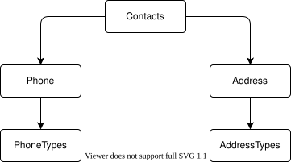

# Workshop Instructions

In this workshop, you will build a controller-based ASP.NET Core Web API over an existing SQLite contacts database. Start with `Contacts.sln` in this folder. When you finish, your API should match the reference implementation in `src/complete`.

> [!IMPORTANT]
> This workshop targets .NET 11 RC 1. .NET 11 general availability is expected in November 2026. The repository's `global.json` pins the tested RC SDK.

## Prerequisites

- .NET SDK `11.0.100-rc.1.26425.128`
- Visual Studio 2026 Insiders with the **ASP.NET and web development** workload, or Visual Studio Code with C# Dev Kit
- Git

From the repository root, verify the SDK:

```console
dotnet --version
```

The output should be `11.0.100-rc.1.26425.128`.

## Explore the starter solution

The starter solution separates the contact domain from data access and business logic:

| Project | Responsibility |
| --- | --- |
| `Contacts.Domain` | Domain models and interfaces |
| `Contacts.Data` | Repository implementation |
| `Contacts.Data.Sqlite` | EF Core SQLite data store and mappings |
| `Contacts.Logic` | Business rules |
| `Contacts.Logic.Tests` | Unit tests for the business layer |

The API will depend on `IContactManager`; the remaining interfaces keep persistence details out of the controller.



## Verify the starter solution

***Note***: I recommend that you make a copy of the starter solution (/start) before making any changes, so you can always refer back to the original state if needed.

Open a Terminal or command prompt and navigate your working directory to the copy of the starter solution folder.

Build and test before adding the API:

```console
dotnet build Contacts.sln
dotnet test Contacts.sln
```

## Create the API project

Choose how you want to create the API project: Visual Studio or .NET CLI.

### Visual Studio

1. Right-click the solution and select **Add** > **New Project**.
2. Select **ASP.NET Core Web API**.
3. Name the project `Contacts.Api`.
4. Choose these options:

   | Option | Value |
   | --- | --- |
   | Framework | .NET 11.0 |
   | Authentication | None |
   | Configure for HTTPS | Checked |
   | Enable container support | Unchecked |
   | Enable OpenAPI support | Checked |
   | Do not use top-level statements | Unchecked |
   | Use controllers | Checked |

5. Click **Create** to add the new project to the solution.
6. Delete `WeatherForecast.cs` and `Controllers/WeatherForecastController.cs` if your template includes them.

### .NET CLI

From this folder:

```console
dotnet new webapi --use-controllers --framework net11.0 --name Contacts.Api
dotnet sln Contacts.sln add Contacts.Api\Contacts.Api.csproj
```

Delete the generated WeatherForecast files if present.

## Add references and Scalar

In a terminal or command prompt, navigate to the root of the API project and add references to the existing projects:

```console
dotnet add Contacts.Api\Contacts.Api.csproj reference Contacts.Data\Contacts.Data.csproj
dotnet add Contacts.Api\Contacts.Api.csproj reference Contacts.Data.Sqlite\Contacts.Data.Sqlite.csproj
dotnet add Contacts.Api\Contacts.Api.csproj reference Contacts.Domain\Contacts.Domain.csproj
dotnet add Contacts.Api\Contacts.Api.csproj reference Contacts.Logic\Contacts.Logic.csproj
```

***Note***: You can use the .NET CLI or Visual Studio to add project references.

The .NET 11 Web API template adds `Microsoft.AspNetCore.OpenApi`. Add Scalar for an interactive browser UI:

```console
dotnet add Contacts.Api\Contacts.Api.csproj package Scalar.AspNetCore --version 2.17.4
```

In `Contacts.Api.csproj`, enable XML documentation and suppress warnings for public members that do not need XML comments. Place the following within a `<PropertyGroup>`:

```xml
<GenerateDocumentationFile>true</GenerateDocumentationFile>
<NoWarn>$(NoWarn);1591</NoWarn>
```

The relevant parts of the project file should now be:

```xml
<PropertyGroup>
  <TargetFramework>net11.0</TargetFramework>
  <Nullable>enable</Nullable>
  <ImplicitUsings>enable</ImplicitUsings>
  <GenerateDocumentationFile>true</GenerateDocumentationFile>
  <NoWarn>$(NoWarn);1591</NoWarn>
</PropertyGroup>

<ItemGroup>
  <PackageReference Include="Microsoft.AspNetCore.OpenApi" Version="11.0.0-rc.1.26425.128" />
  <PackageReference Include="Scalar.AspNetCore" Version="2.17.4" />
</ItemGroup>

<ItemGroup>
  <None Update="contacts.db">
    <CopyToOutputDirectory>PreserveNewest</CopyToOutputDirectory>
    <CopyToPublishDirectory>PreserveNewest</CopyToPublishDirectory>
  </None>
</ItemGroup>
```

## Configure the database

Copy `..\sqlite\contacts.db` into the root of the new `Contacts.Api` project.

Add the connection string to `Contacts.Api/appsettings.json`:

```json
"ConnectionStrings": {
  "ContactsDatabaseSqlite": "Data Source=contacts.db"
},
```

The data source is relative to the API project's working directory.

The prepared database uses SQLite primary keys and foreign keys that match the EF Core model. If you recreate it from the SQL scripts, start with an empty database and run `create-tables.sql` before `create-data.sql`.

## Configure services and middleware

Replace `Contacts.Api/Program.cs` with:

```csharp
using Contacts.Data;
using Contacts.Data.Sqlite;
using Contacts.Domain.Interfaces;
using Contacts.Logic;
using Microsoft.EntityFrameworkCore;
using Scalar.AspNetCore;

var builder = WebApplication.CreateBuilder(args);

// Add services to the container.
var connectionString = builder.Configuration.GetConnectionString("ContactsDatabaseSqlite")
    ?? throw new InvalidOperationException(
        "Connection string 'ContactsDatabaseSqlite' was not found.");

builder.Services.AddDbContext<ContactContext>(options =>
    options.UseSqlite(
        connectionString,
        sqliteOptions => sqliteOptions.UseQuerySplittingBehavior(
            QuerySplittingBehavior.SplitQuery)));
builder.Services.AddScoped<IContactDataStore, SqliteDataStore>();
builder.Services.AddScoped<IContactRepository, ContactRepository>();
builder.Services.AddScoped<IContactManager, ContactManager>();

builder.Services.AddControllers();
builder.Services.AddProblemDetails();
builder.Services.AddOpenApi(options =>
{
    options.AddDocumentTransformer((document, _, _) =>
    {
        document.Info = new()
        {
            Title = "Contacts API",
            Version = "v1",
            Description = "Create, retrieve, search, and delete contacts."
        };

        return Task.CompletedTask;
    });
});

var app = builder.Build();

// Configure the HTTP request pipeline.
if (app.Environment.IsDevelopment())
{
    app.MapOpenApi();
    app.MapScalarApiReference();
}

app.UseExceptionHandler();
app.UseHttpsRedirection();
app.UseAuthorization();
app.MapControllers();

app.Run();
```

`DbContext` is scoped to one request, so the data store, repository, and manager are also scoped. The built-in OpenAPI endpoint and Scalar UI are exposed only in Development.

Update the `https`project profile in `Properties/launchSettings.json` to use the workshop ports and open Scalar:

```json
"launchUrl": "scalar/v1",
"applicationUrl": "https://localhost:7113;http://localhost:5103"
```

Set `"launchUrl": "scalar/v1"` on any other profile you plan to use. Run the API with the project profile so the sample requests use the same HTTPS port.

***Note***: Make sure to use the correct launch profile when running the API to ensure the sample requests use the expected ports.

***Note***: You can delete the `http` profile if you only want to use HTTPS.

Build the solution before continuing:

```console
dotnet build Contacts.sln
```

## Create the contacts controller

Add `Controllers/ContactsController.cs`:

```csharp
using System.ComponentModel.DataAnnotations;
using Contacts.Domain.Interfaces;
using Contacts.Domain.Models;
using Microsoft.AspNetCore.Mvc;

namespace Contacts.Api.Controllers;

[ApiController]
[Route("api/[controller]")]
public class ContactsController(IContactManager contactManager) : ControllerBase
{
    /// <summary>
    /// Gets all contacts.
    /// </summary>
    /// <returns>All available contacts.</returns>
    [HttpGet]
    [ProducesResponseType<IReadOnlyList<Contact>>(StatusCodes.Status200OK)]
    public async Task<ActionResult<IReadOnlyList<Contact>>> GetContacts()
    {
        var contacts = await contactManager.GetContactsAsync();
        return Ok(contacts);
    }

    /// <summary>
    /// Gets a contact by identifier.
    /// </summary>
    /// <param name="id">The contact identifier.</param>
    /// <returns>The matching contact.</returns>
    [HttpGet("{id:int}")]
    [ProducesResponseType<Contact>(StatusCodes.Status200OK)]
    [ProducesResponseType(StatusCodes.Status404NotFound)]
    public async Task<ActionResult<Contact>> GetContact(int id)
    {
        var contact = await contactManager.GetContactAsync(id);
        return contact is null ? NotFound() : Ok(contact);
    }

    /// <summary>
    /// Creates a contact.
    /// </summary>
    /// <param name="contact">The contact to create.</param>
    /// <returns>The created contact and its location.</returns>
    [HttpPost]
    [ProducesResponseType<Contact>(StatusCodes.Status201Created)]
    [ProducesResponseType<ValidationProblemDetails>(StatusCodes.Status400BadRequest)]
    [ProducesResponseType<ProblemDetails>(StatusCodes.Status500InternalServerError)]
    public async Task<ActionResult<Contact>> SaveContact(Contact contact)
    {
        var savedContact = await contactManager.SaveContactAsync(contact);

        return savedContact is null
            ? Problem(
                title: "Unable to create contact",
                detail: "The contact data store did not save the contact.")
            : CreatedAtAction(
                nameof(GetContact),
                new { id = savedContact.ContactId },
                savedContact);
    }

    /// <summary>
    /// Deletes a contact.
    /// </summary>
    /// <param name="id">The contact identifier.</param>
    [HttpDelete("{id:int}")]
    [ProducesResponseType(StatusCodes.Status204NoContent)]
    [ProducesResponseType(StatusCodes.Status404NotFound)]
    public async Task<IActionResult> DeleteContact(int id)
    {
        var wasDeleted = await contactManager.DeleteContactAsync(id);
        return wasDeleted ? NoContent() : NotFound();
    }

    /// <summary>
    /// Searches for contacts by first and last name.
    /// </summary>
    /// <param name="firstName">The first name to match.</param>
    /// <param name="lastName">The last name to match.</param>
    /// <returns>Contacts that match both names.</returns>
    [HttpGet("search")]
    [ProducesResponseType<IReadOnlyList<Contact>>(StatusCodes.Status200OK)]
    [ProducesResponseType<ValidationProblemDetails>(StatusCodes.Status400BadRequest)]
    public async Task<ActionResult<IReadOnlyList<Contact>>> SearchContacts(
        [FromQuery, Required] string firstName,
        [FromQuery, Required] string lastName)
    {
        var contacts = await contactManager.GetContactsAsync(firstName, lastName);
        return Ok(contacts);
    }

    /// <summary>
    /// Gets all phone numbers for a contact.
    /// </summary>
    /// <param name="id">The contact identifier.</param>
    /// <returns>The contact's phone numbers.</returns>
    [HttpGet("{id:int}/phones")]
    [ProducesResponseType<IReadOnlyList<Phone>>(StatusCodes.Status200OK)]
    public async Task<ActionResult<IReadOnlyList<Phone>>> GetContactPhones(int id)
    {
        var phones = await contactManager.GetContactPhonesAsync(id);
        return Ok(phones);
    }

    /// <summary>
    /// Gets a specific phone number for a contact.
    /// </summary>
    /// <param name="id">The contact identifier.</param>
    /// <param name="phoneId">The phone identifier.</param>
    /// <returns>The matching phone number.</returns>
    [HttpGet("{id:int}/phones/{phoneId:int}")]
    [ProducesResponseType<Phone>(StatusCodes.Status200OK)]
    [ProducesResponseType(StatusCodes.Status404NotFound)]
    public async Task<ActionResult<Phone>> GetContactPhone(int id, int phoneId)
    {
        var phone = await contactManager.GetContactPhoneAsync(id, phoneId);
        return phone is null ? NotFound() : Ok(phone);
    }

    /// <summary>
    /// Gets all addresses for a contact.
    /// </summary>
    /// <param name="id">The contact identifier.</param>
    /// <returns>The contact's addresses.</returns>
    [HttpGet("{id:int}/addresses")]
    [ProducesResponseType<IReadOnlyList<Address>>(StatusCodes.Status200OK)]
    public async Task<ActionResult<IReadOnlyList<Address>>> GetContactAddresses(int id)
    {
        var addresses = await contactManager.GetContactAddressesAsync(id);
        return Ok(addresses);
    }

    /// <summary>
    /// Gets a specific address for a contact.
    /// </summary>
    /// <param name="id">The contact identifier.</param>
    /// <param name="addressId">The address identifier.</param>
    /// <returns>The matching address.</returns>
    [HttpGet("{id:int}/addresses/{addressId:int}")]
    [ProducesResponseType<Address>(StatusCodes.Status200OK)]
    [ProducesResponseType(StatusCodes.Status404NotFound)]
    public async Task<ActionResult<Address>> GetContactAddress(int id, int addressId)
    {
        var address = await contactManager.GetContactAddressAsync(id, addressId);
        return address is null ? NotFound() : Ok(address);
    }
}
```

The route constraints (`{id:int}`) prevent the action from matching non-integer identifiers. `CreatedAtAction` returns `201 Created`, the saved representation, and a `Location` header for the new resource. Delete returns `204 No Content`.

## Run and inspect the API

Start the API:

```console
dotnet run --project Contacts.Api
```

Open the HTTPS address shown in the console with `/scalar/v1`:

```text
https://localhost:7113/scalar/v1
```

Scalar reads the OpenAPI document from `/openapi/v1.json`. Confirm that all nine operations appear and that the response types and XML summaries are present.

## Exercise the endpoints

Open `Contacts-Sample-Requests.http`, select the `dev` environment, and run the requests in order. The create request is named so the successful delete request can reuse its returned `contactId`. Confirm:

- `GET /api/contacts` returns `200`.
- An existing contact returns `200`; an unknown contact returns `404`.
- A valid `POST` returns `201`, the saved contact, and a `Location` header.
- Invalid input returns an RFC 9457 validation problem response with `400`.
- A successful delete returns `204`; deleting an unknown contact returns `404`.

## Final verification

```console
dotnet build Contacts.sln --configuration Release
dotnet test Contacts.sln --configuration Release --no-build
```

Compare your API project with `src/complete/Contacts.Api` if you need a reference.

## After .NET 11 general availability

When .NET 11 ships:

1. Update `global.json` to the GA `11.0.100` SDK.
2. Replace `11.0.0-rc.1.26425.128` package versions with `11.0.0`.
3. Restore, build, test, and rerun the HTTP requests.
4. Remove the prerelease notice from the README and these instructions.

## References

- [What's new in .NET 11](https://learn.microsoft.com/dotnet/core/whats-new/dotnet-11/overview)
- [What's new in C# 15](https://learn.microsoft.com/dotnet/csharp/whats-new/csharp-15)
- [OpenAPI support in ASP.NET Core](https://learn.microsoft.com/aspnet/core/fundamentals/openapi/overview)
- [Use Scalar for interactive API documentation](https://learn.microsoft.com/aspnet/core/fundamentals/openapi/using-openapi-documents#use-scalar-for-interactive-api-documentation)
- [Create web APIs with controllers](https://learn.microsoft.com/aspnet/core/web-api/)
